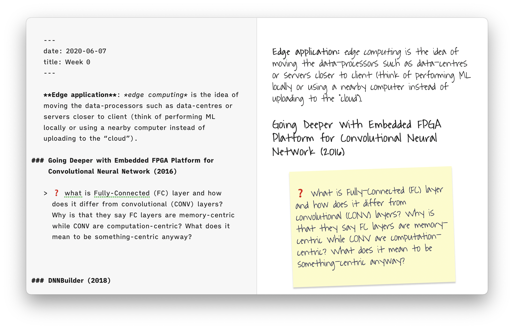
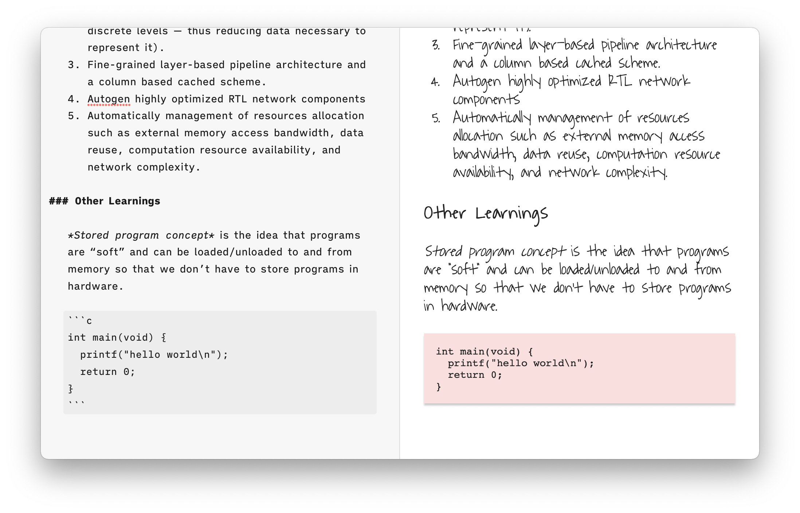
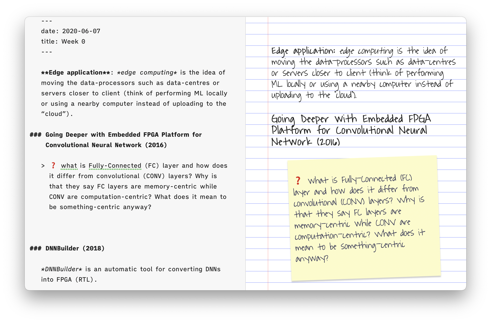
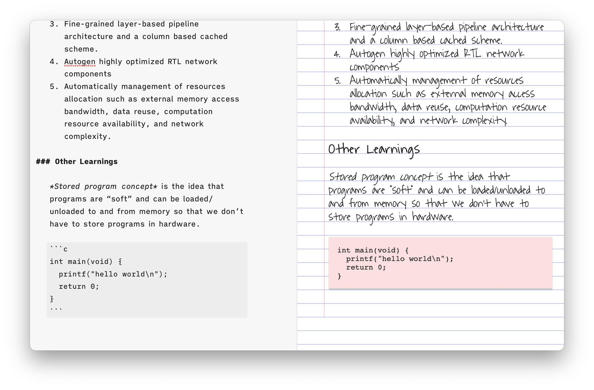

# Diary Template

This template was initially to make my writing and diary feel more unique and personal.

For my personal use, I created my own typeface based from my own handwriting --
but I don't feel comfortable sharing that publically, so instead I substituted it with
the type "Waiting for the Sunrise" by [Kimberly Geswein](https://fonts.google.com/?query=Kimberly%20Geswein).

I've also made blockquotes and code fences into sticky-notes, for that extra "handmade" feel.

There are two variants: blank paper vs. lined paper to immatate writing on real paper. However, adding images, lists, tables, etc. will make the text deviate from the lined paper -- an inherent flaw of web-based content. For that reason, I only use the cool-looking lined paper for short writing and text-only exerpts.

## Preview

**Blank Paper**:

**Lined Paper**:

